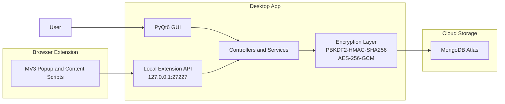

# PPW

PPW is a Windows password manager built with Python and PyQt6, backed by MongoDB Atlas for persistence and paired with a browser extension for local auto-fill. The project focuses on desktop UX, client-side encryption, and packaging a multi-component app into a distributable Windows release.

## What It Includes

- Desktop vault application with account creation, login, search, filtering, and CRUD flows for saved credentials
- Client-side encryption using PBKDF2-HMAC-SHA256 for key derivation and AES-256-GCM for stored secrets
- Password generator with configurable character sets and strength scoring
- Security dashboard for weak-password visibility, password age checks, and 2FA coverage tracking
- Manifest V3 browser extension that talks to the desktop app over `127.0.0.1:27227`
- Windows packaging via PyInstaller and Inno Setup, with release automation tracked in the repository

## Architecture



The extension does not connect to an external API. It only communicates with the local desktop process while the vault is unlocked.

## Technical Highlights

- Encryption model: a master password derives a 256-bit key with PBKDF2, and a per-user encryption key is wrapped so stored secrets do not need to be re-encrypted when the master password changes.
- Desktop architecture: controller and service layers separate GUI actions from persistence and encryption logic.
- Extension bridge: a lightweight local HTTP server exposes vault data to the extension only for the active unlocked desktop session.
- Operational hardening: failed-login lockout, per-session extension token rotation, and MongoDB indexes defined in the database layer.

## Stack

- Python 3.9+
- PyQt6
- cryptography
- pymongo
- MongoDB Atlas
- JavaScript Manifest V3 browser extension
- PyInstaller
- Inno Setup
- GitHub Actions

## Repository Layout

```text
controllers/   GUI-facing application logic
db/            MongoDB connection, schemas, indexes
services/      account and authentication services
utils/         encryption, logging, local extension API
extension/     browser extension source and packaging files
gui_app.py     desktop UI
main.py        app entry point with GUI and CLI fallback
build.py       Windows build pipeline helper
installer.iss  Inno Setup installer definition
```

## Running Locally

### Prerequisites

- Python 3.9+
- MongoDB Atlas connection string
- Windows environment for the packaged desktop workflow

### Setup

```bash
pip install -r requirements.txt
copy .env.example .env
python main.py
```

Set `MONGO_URI` in `.env` before launching the app.

For CLI fallback:

```bash
python main.py --cli
```

For browser extension setup and loading instructions, see [extension/README.md](extension/README.md).

## Build and Release

```bash
python build.py
```

The repository also includes [installer.iss](installer.iss) for Windows installer generation and [CHANGELOG.md](CHANGELOG.md) for release notes.

## Security Notes

- Master passwords are verified from derived values rather than stored in plaintext.
- Stored vault data is encrypted before it is persisted to MongoDB.
- The extension API binds to localhost only and issues a fresh token on unlock.
- After five failed login attempts, accounts are locked for 30 minutes.

## Current Scope

- Desktop-first, Windows-focused application
- Browser extension depends on the desktop app being open and unlocked
- 2FA is tracked as account metadata in the vault; PPW does not implement TOTP generation or MFA enforcement

## Additional Documentation

- [CHANGELOG.md](CHANGELOG.md)
- [extension/README.md](extension/README.md)
- [LICENSE](LICENSE)
